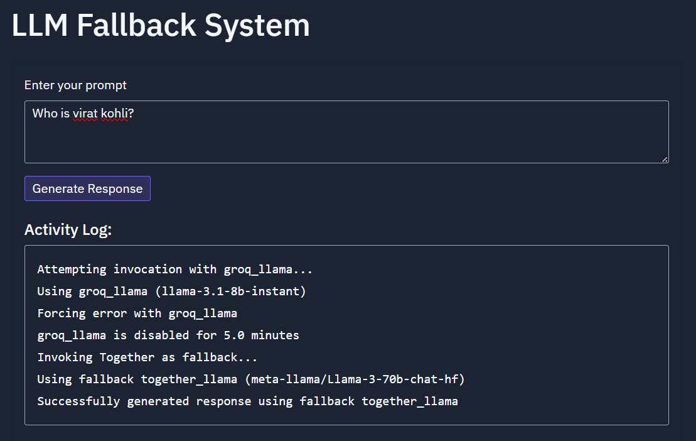

# LLM Fallback System

A robust multi-provider LLM system with dynamic routing and intelligent error handling. The system automatically switches between different LLM providers (Groq and Together) when errors occur, ensuring high availability and reliability.

## Features

- 🔄 Dynamic provider selection
- ⚡ Automatic fallback handling
- 📊 Detailed activity logging
- 🚀 Production-ready with Docker support
- 🔐 Secure API key management

## Architecture

The system uses a priority-based routing system with the following providers:

1. **Primary**: Groq LLM (llama-3.1-8b-instant)
2. **Fallback**: Together AI (meta-llama/Llama-3-70b-chat-hf)
3. **Backup**: Groq Mixtral (mixtral-8x7b-32768)

## Prerequisites

- Python 3.11+
- Docker and Docker Compose (for containerized deployment)
- API keys for:
  - Groq
  - Together AI

## Local Development Setup

1. **Clone the repository**
   ```bash
   git clone <repository-url>
   cd llm-fallback-system
   ```

2. **Install dependencies**
   ```bash
   pip install -r requirements.txt
   ```

3. **Set up environment variables**
   Create a `.env` file:
   ```bash
   GROQ_API_KEY=your_groq_key
   TOGETHER_LLAMA_API_KEY=your_together_key
   SESSION_SECRET=your_secret_key
   ```

4. **Run the application**
   ```bash
   python main.py
   ```

   The application will be available at `http://localhost:5000`

## Docker Deployment

1. **Build and run with Docker Compose**
   ```bash
   docker-compose up --build
   ```

2. **Access the application**
   Open `http://localhost:5000` in your browser

## API Usage

### Generate Response
```bash
curl -X POST http://localhost:5000/api/generate \
  -H "Content-Type: application/json" \
  -d '{"prompt": "Who is Virat Kohli?"}'
```

Response format:
```json
{
  "response": "Generated text...",
  "provider": "groq_llama",
  "model": "llama-3.1-8b-instant",
  "activity_log": [
    "Attempting invocation with groq_llama...",
    "Using groq_llama (llama-3.1-8b-instant)",
    "..."
  ]
}
```

## System Components

### Provider Classes
- `BaseProvider`: Abstract base class for LLM providers
- `GroqProvider`: Implementation for Groq API
- `TogetherProvider`: Implementation for Together AI

### Router
- `ModelRouter`: Handles provider selection and fallback logic
- Implements cooldown periods for failed providers
- Manages detailed activity logging

## Error Handling

The system includes comprehensive error handling:
- API connection failures
- Invalid responses
- Rate limiting
- Provider-specific errors

When an error occurs with the primary provider:
1. The error is logged
2. The provider is put in cooldown
3. The system automatically fails over to the next available provider

## Monitoring and Logging

- Detailed activity logs in `logs/usage.log`
- Provider status tracking
- Request/response monitoring
- Error tracking and diagnostics

## Configuration

The system is configured through `providers.yaml`:
```yaml
providers:
  - name: "groq_llama"
    endpoint: "https://api.groq.com/openai/v1/chat/completions"
    model: "llama-3.1-8b-instant"
    priority: 1
  # ... additional providers
```

## Contributing

1. Fork the repository
2. Create a feature branch
3. Commit your changes
4. Push to the branch
5. Create a Pull Request

## License

This project is licensed under the MIT License - see the LICENSE file for details.
## Results
fallback

response


